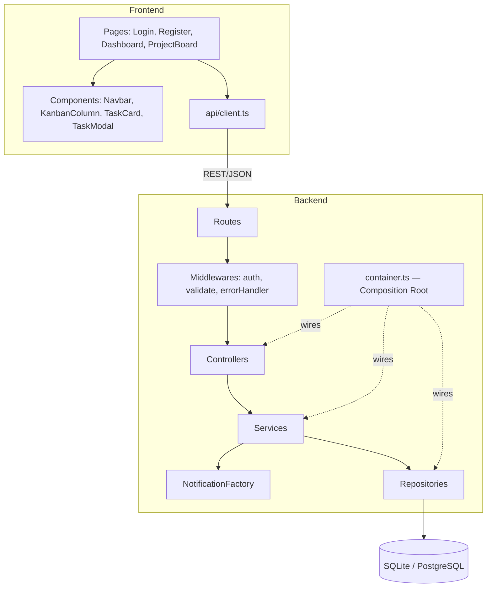
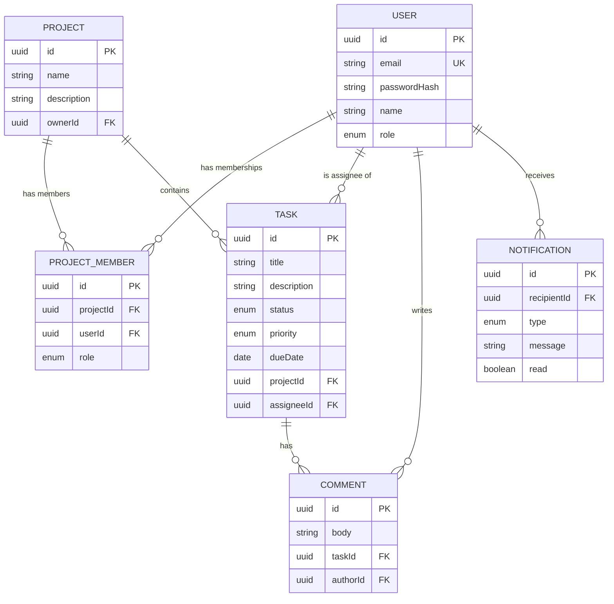
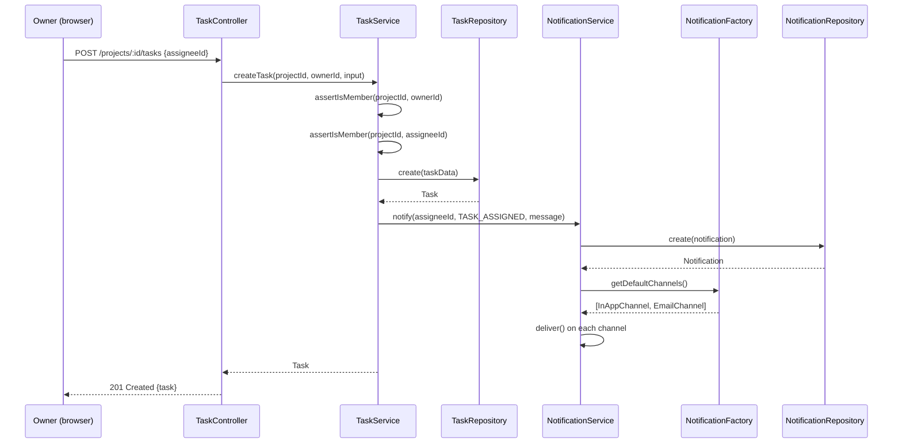
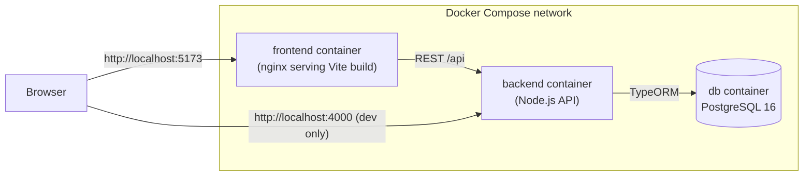

# Architecture Documentation

## 1. Architectural style

TaskFlow's backend follows a **layered (n-tier) architecture** with an
explicit **MVC** shape for the HTTP boundary, a **Service Layer** for
business logic, and a **Repository Layer** for persistence — each layer
depending only on the abstraction of the layer below it.

```
┌─────────────────────────────────────────────────────────────┐
│  Frontend (React SPA) — the "View"                          │
│  pages/ → components/ → api/client.ts (typed HTTP client)   │
└───────────────────────────────┬─────────────────────────────┘
                                 │ HTTPS / JSON (REST)
┌───────────────────────────────▼─────────────────────────────┐
│  Express App (backend/src/app.ts)                            │
│  ┌───────────────┐   ┌────────────────┐   ┌────────────────┐│
│  │ Middlewares    │→ │ Controllers     │→ │ Routes          ││
│  │ auth, validate,│   │ (MVC "Controller")│  (Express Router)││
│  │ errorHandler   │   │ HTTP <-> Service │  │                ││
│  └───────────────┘   └────────┬───────┘   └────────────────┘│
└────────────────────────────────┼──────────────────────────────┘
                                  │ calls
┌────────────────────────────────▼──────────────────────────────┐
│  Service Layer (backend/src/services)                          │
│  AuthService, ProjectService, TaskService, CommentService,     │
│  NotificationService — ALL business rules & authorization live │
│  here. Depend only on Repository *interfaces*.                 │
└────────────────────────────────┬──────────────────────────────┘
                                  │ depends on (interfaces)
┌────────────────────────────────▼──────────────────────────────┐
│  Repository Layer (backend/src/repositories)                   │
│  UserRepository, ProjectRepository, TaskRepository, ...        │
│  Implements interfaces from src/interfaces/repositories.ts.    │
│  Only place that talks to TypeORM.                             │
└────────────────────────────────┬──────────────────────────────┘
                                  │
┌────────────────────────────────▼──────────────────────────────┐
│  Database (SQLite in dev/test, PostgreSQL in Docker/prod)      │
└──────────────────────────────────────────────────────────────┘
```

Every arrow above points **downward through an interface**, never a
concrete class from two layers away — see
[`04-solid-principles.md`](04-solid-principles.md) for how this realizes
the Dependency Inversion Principle, and why it made the entire service
layer unit-testable without a database (see
[`05-testing-report.md`](05-testing-report.md)).

## 2. Component diagram (Mermaid)



## 3. Entity-relationship diagram



## 4. Key sequence: assigning a task triggers a notification



## 5. Folder-to-responsibility map

| Folder | Responsibility | Pattern |
|---|---|---|
| `backend/src/entities` | Persistence-shape of domain objects (TypeORM decorators) | Model (MVC) |
| `backend/src/interfaces` | Contracts services depend on, not concretions | Dependency Inversion |
| `backend/src/repositories` | Data access, one class per aggregate | Repository |
| `backend/src/services` | Business rules, authorization, orchestration | Service Layer |
| `backend/src/factories` | Selects and constructs notification channels | Factory |
| `backend/src/controllers` | Translates HTTP requests to service calls | Controller (MVC) |
| `backend/src/routes` | Express route wiring, one file per resource | — |
| `backend/src/middlewares` | Cross-cutting concerns: auth, validation, errors | — |
| `backend/src/dto` | Zod input-validation schemas | DTO |
| `backend/src/container.ts` | Wires concrete classes into interfaces | Composition Root / DI |
| `frontend/src/pages` | Route-level views | View (MVC) |
| `frontend/src/components` | Reusable, presentational + lightly-stateful UI | — |
| `frontend/src/api/client.ts` | Single point of contact with the backend | Facade |
| `frontend/src/context` | App-wide state (authenticated user) | — |

## 6. Data flow example: loading the Kanban board

1. `ProjectBoardPage` mounts, calls `api.projects.get`, `api.tasks.listForProject`,
   `api.projects.listMembers` in parallel via `Promise.all`.
2. Each call goes through `api/client.ts`'s single `request()` helper,
   which attaches the JWT and normalizes errors into `ApiError`.
3. Express routes authenticate the JWT (`middlewares/auth.ts`), validate
   any body (`middlewares/validate.ts`), then delegate to the relevant
   controller.
4. Controllers call the corresponding service method and return its result
   as JSON — controllers contain **no** business logic.
5. Services enforce authorization (project membership) and call
   repositories for persistence.
6. The rendered board groups tasks client-side by `status` into three
   `KanbanColumn`s; drag-and-drop optimistically updates local state, then
   persists via `PATCH /tasks/:id`, reconciling with a re-fetch on failure.

## 7. Deployment architecture



See [`06-devops-report.md`](06-devops-report.md) for the full container and
pipeline design.
